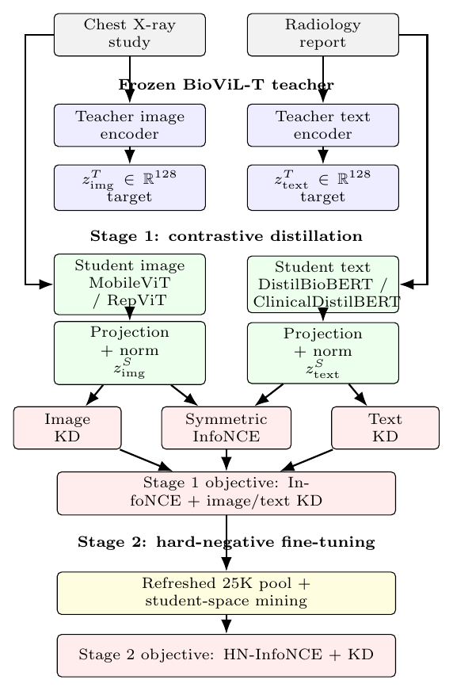

# Distilling BioViL-T for Efficient Chest X-ray Image–Report Retrieval

Official repository for the paper **"Distilling BioViL-T for Efficient Chest
X-ray Image–Report Retrieval."** We compress the biomedical vision–language model
**BioViL-T** into compact student encoder pairs for chest X-ray ↔ radiology-report
retrieval, using a two-stage **contrastive + hard-negative** knowledge-distillation
framework. Evaluated on the full **14,018-study MIMIC-CXR test gallery**, the
DistilBioBERT-paired students substantially exceed the teacher's retrieval recall
while using roughly an order of magnitude fewer image-encoder parameters and FLOPs.

📄 **Paper:** [`docs/paper.pdf`](docs/paper.pdf) &nbsp;•&nbsp;
📊 **Results:** [`results/`](results/) &nbsp;•&nbsp;
🧪 **Code:** [`src/`](src/)

---

## Overview

Large biomedical vision–language models such as BioViL-T achieve strong
cross-modal alignment between chest radiographs and radiology reports, but their
size makes them impractical to deploy on local or resource-constrained clinical
hardware. We distil a **frozen** BioViL-T teacher into compact student encoder
pairs that preserve — and on whole-gallery retrieval, exceed — the teacher's
retrieval ability at a fraction of the cost.

The framework has two stages. **Stage 1 (contrastive distillation)** trains the
student with a symmetric InfoNCE objective combined with a feature-imitation term
that regresses student embeddings toward the cached teacher embeddings.
**Stage 2 (hard-negative fine-tuning)** refines the student using hard negatives
mined from a 25,000-sample candidate pool, inserted directly into the contrastive
denominator.

<p align="center">
  
</p>
<p align="center">
  <em>Figure 1: The proposed two-stage distillation framework.</em>
</p>

We instantiate **four student pairs** by combining two image encoders
(MobileViT-Small, RepViT-M1.1) with two text encoders (DistilBioBERT,
ClinicalDistilBERT), and evaluate them against the BioViL-T teacher and a suite of
medical and general-domain baselines — all on the identical full test gallery.

---

## Highlights

- **Students exceed their teacher.** On full-gallery retrieval, the DistilBioBERT
  students reach up to **~3.7× the teacher's R@1**, despite using far smaller
  image encoders (5.3M / 8.0M vs 27.4M parameters).
- **Text encoder dominates.** Swapping DistilBioBERT for ClinicalDistilBERT drops
  retrieval below the teacher, showing the **text-encoder choice is the primary
  design decision** for this task.
- **Stage 1 carries the gains.** Hard-negative fine-tuning yields only minor,
  architecture-dependent changes; contrastive distillation is the main driver.
- **Fair evaluation.** All models — students, teacher, and baselines — are scored
  on the **identical 14,018-study gallery**, since retrieval recall depends
  strongly on gallery size.

---

## Main Results

Test-set retrieval on the identical 14,018-study MIMIC-CXR gallery. Best student
result per column in **bold** (S1 = Stage 1 contrastive, S2 = Stage 2 hard-negative).

| Model | Stage | I→T R@1 | I→T R@5 | I→T R@10 | T→I R@1 | I→T Med. Rank |
|-------|:-----:|--------:|--------:|---------:|--------:|--------------:|
| BioViL-T Teacher | – | 0.0118 | 0.0447 | 0.0702 | 0.0148 | 467 |
| **MobileViT + DistilBioBERT** | S1 | **0.0433** | **0.1293** | **0.1943** | **0.0405** | **86** |
| MobileViT + DistilBioBERT | S2 | 0.0399 | 0.1273 | 0.1894 | 0.0372 | 91 |
| RepViT + DistilBioBERT | S1 | 0.0270 | 0.0937 | 0.1495 | 0.0276 | 129 |
| RepViT + DistilBioBERT | S2 | 0.0273 | 0.0989 | 0.1515 | 0.0263 | 122 |
| MobileViT + ClinicalDistilBERT | S2 | 0.0075 | 0.0275 | 0.0465 | 0.0057 | 620 |
| RepViT + ClinicalDistilBERT | S2 | 0.0069 | 0.0266 | 0.0430 | 0.0064 | 635 |

**Efficiency (single-view, like-for-like with the teacher image encoder):**

| Component | FLOPs | Params | Latency (ms) |
|-----------|------:|-------:|-------------:|
| MobileViT-S student | 2.87 G | 5.33 M | 8.84 ± 0.50 |
| RepViT-M1.1 student | 2.70 G | 8.02 M | 11.77 ± 0.50 |
| BioViL-T image encoder | 8.27 G | 27.35 M | 7.24 ± 0.26 |

**Strongest baseline.** Among external baselines, **ConVIRT** is the best model on
this gallery (I→T R@1 = 0.0754), exceeding both the teacher and the distilled
students; general-domain models (CLIP, MobileCLIP, TinyCLIP) perform near chance.
Full baseline numbers are in [`results/baselines.csv`](results/baselines.csv).

---

## Repository Structure

```
BioViL-T-Retrieval-KD/
├── README.md
├── docs/                                 Paper, documentation, and figures
│   ├── paper.pdf
│   └── architecture.png
├── results/                              Metric files backing the paper tables
│   ├── retrieval_test_metrics.{json,csv} Table I  — retrieval (4 students + teacher)
│   ├── distillation_recovery.csv         Table II — recovery vs teacher
│   ├── efficiency.csv                    Table III— FLOPs / params / latency
│   ├── baselines.csv                     Table IV — baseline comparison
│   └── gradcam_concentration.csv         Appendix — per-study Grad-CAM++ scores
└── src/
    ├── students/                         The four distilled student pairs
    │   ├── DistilBioBERT-paired_models/      MobileViT / RepViT + DistilBioBERT
    │   └── ClinicalDistilBERT-paired_models/ MobileViT / RepViT + ClinicalDistilBERT
    ├── baselines/                        Baseline retrieval evaluations
    ├── interpretability/                 Grad-CAM++ analysis (students vs teacher)
    └── collaborator_pipeline/            Config-driven pipeline producing the
                                          ClinicalDistilBERT students
```

Each major folder contains its own `README.md`.

---

## Method

**Teacher.** BioViL-T maps a study's radiographs and report into a shared 128-d
space. Teacher embeddings are extracted once offline and cached, so the teacher is
never run during student training.

**Stage 1 — Contrastive distillation.** For a batch of image–text pairs, a
symmetric InfoNCE loss trains the student to rank each matched pair above the
others in both directions. A feature-imitation term (mean squared error + cosine)
regresses the student embeddings toward the teacher embeddings, keeping the
student compatible with the teacher space. The Stage 1 objective is
InfoNCE + λ·(image KD + text KD).

**Stage 2 — Hard-negative fine-tuning.** Starting from the best Stage 1
checkpoint, the student is fine-tuned with the top-K most-similar non-matching
reports inserted as additional negatives in the InfoNCE denominator, drawn from a
25,000-sample candidate pool. The feature-imitation regularizer is retained.

**Students.** Image: MobileViT-Small or RepViT-M1.1, with a projection head to the
128-d space and masked-mean fusion over up to three views. Text: DistilBioBERT or
ClinicalDistilBERT (~65M params each), projected to the same 128-d space.

**Checkpoint selection.** Because the task is retrieval, checkpoints are selected
on validation Recall@1 rather than training loss.

---

## Dataset

Experiments use **MIMIC-CXR-JPG**, organized at the study level with
**subject-level** splits (no subject appears in more than one split):

| Split | Studies |
|-------|--------:|
| Train | 128,924 |
| Validation | 1,201 |
| Test | 14,018 |

> MIMIC-CXR requires **PhysioNet credentialed access** and is **not** included in
> this repository. Large binary artifacts (checkpoints, embeddings, weights, image
> data) are excluded via [`.gitignore`](.gitignore).

---

## Reproducing the Results

1. Provide the cached BioViL-T teacher embeddings and the subject-level split
   indices.
2. Run the relevant notebook in [`src/students/`](src/students/) end-to-end — each
   is self-contained (dataset construction, Stage 1, Stage 2, and full-gallery
   evaluation).
3. Reproduce baseline numbers from [`src/baselines/`](src/baselines/) and the
   Grad-CAM++ figures from [`src/interpretability/`](src/interpretability/).

**Evaluation protocol.** All models are scored on the identical full 14,018-study
test gallery. The validation gallery (1,201 studies) is used only for checkpoint
selection. Metrics are reported as Recall@{1,5,10}, median rank, and mean rank for
both image-to-text and text-to-image retrieval.

**Training configuration.** AdamW, learning rate 1e-4, batch size 32,
temperature 0.07, feature-imitation weight 0.25, up to 3 views per study
(masked mean), text length 128, K = 5 hard negatives from a 25,000-sample pool.

---

## A Note on the Two Implementations

This repository contains two implementations of the distillation pipeline. The
**DistilBioBERT students** (`src/students/DistilBioBERT-paired_models/`) mine hard
negatives in the **student's own embedding space**. The **collaborator pipeline**
(`src/collaborator_pipeline/`), which produces the **ClinicalDistilBERT students**,
mines hard negatives in the **teacher embedding space**. These implement different
hard-negative mining algorithms and are not interchangeable.

---

## Authors

Abdallah A. Abdallah, Shahd M. Ammar, Abdulrahman M. Riyad, Abanoub S. Farhan,
Marawan M. Fouad, Ahmed H. Abdelgawwad, and Mohamed A. Yehia.

Department of Computer Science and Engineering, Egypt-Japan University of Science
and Technology (EJUST), Alexandria, Egypt.

---

## Citation

```bibtex
@inproceedings{abdallah2026distilling,
  title     = {Distilling BioViL-T for Efficient Chest X-ray Image--Report Retrieval},
  author    = {Abdallah, Abdallah A. and Ammar, Shahd M. and Riyad, Abdulrahman M.
               and Farhan, Abanoub S. and Fouad, Marawan M. and Abdelgawwad, Ahmed H.
               and Yehia, Mohamed A.},
  year      = {2026}
}
```

---

## Acknowledgements

The authors thank Associate Professor **Ehab Elshazly**, Department of Computer
Science and Engineering, Egypt-Japan University of Science and Technology (EJUST),
for his guidance and supervision throughout this work.
