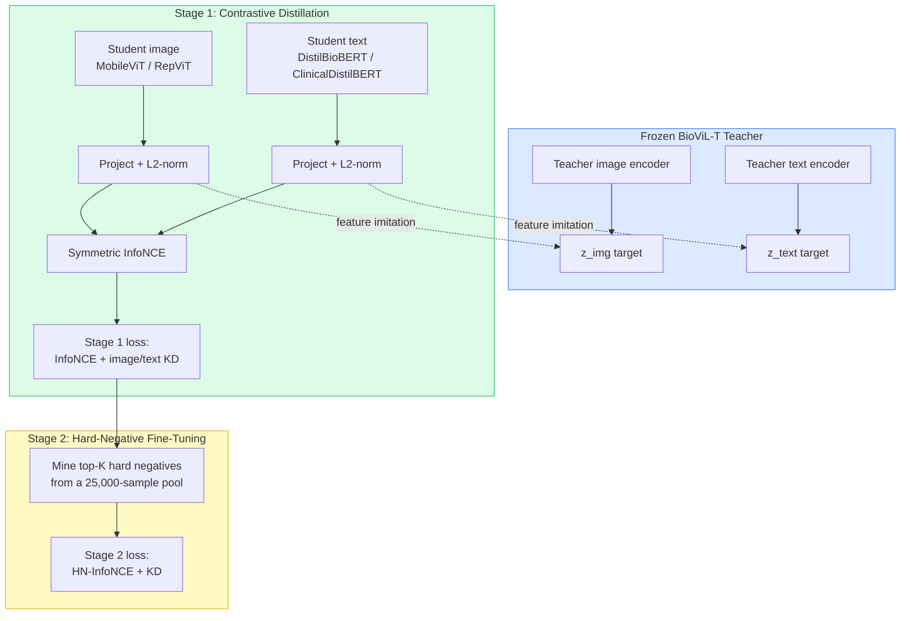
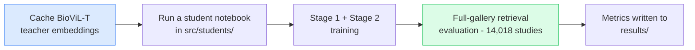

# Distilling BioViL-T for Efficient Chest X-ray Image–Report Retrieval

> Compressing the biomedical vision–language model **BioViL-T** into compact
> student encoder pairs for chest X-ray ↔ radiology-report retrieval, via a
> two-stage **contrastive + hard-negative** knowledge-distillation framework.

<p align="center">
  <em>Evaluated on the full 14,018-study MIMIC-CXR test gallery, the
  DistilBioBERT-paired students substantially exceed the teacher's retrieval
  recall while using roughly an order of magnitude fewer image-encoder
  parameters and FLOPs.</em>
</p>

---

## Table of Contents

- [Overview](#overview)
- [Method](#method)
- [Key Results](#key-results)
- [Repository Structure](#repository-structure)
- [Dataset](#dataset)
- [Reproducing the Results](#reproducing-the-results)
- [The Four Student Configurations](#the-four-student-configurations)
- [A Note on the Two Implementations](#a-note-on-the-two-implementations)
- [Authors](#authors)
- [Citation](#citation)

---

## Overview

Large biomedical vision–language models such as **BioViL-T** achieve strong
cross-modal alignment between chest radiographs and radiology reports, but their
size makes them impractical to deploy on local or resource-constrained clinical
hardware. We distil BioViL-T into **compact student encoder pairs** that preserve 
and on whole gallery retrieval, exceed the teacher's retrieval ability at a
fraction of the cost.

<p align="center">
  
</p>
<p align="center"><em>Figure 1: The proposed two-stage distillation framework.</em></p>

---

## Method

The framework distils a **frozen** BioViL-T teacher into student encoder pairs in
two stages.



**Stage 1 — Contrastive distillation.** A symmetric InfoNCE objective over
image–text pairs aligns the student to rank matched pairs above non-matched ones,
combined with a feature-imitation term (MSE + cosine) that regresses student
embeddings toward the frozen teacher embeddings.

**Stage 2 — Hard-negative fine-tuning.** The Stage-1 student is fine-tuned with
hard negatives drawn from a 25,000-sample candidate pool and inserted directly
into the contrastive denominator, sharpening the ranking structure required for
retrieval.

We instantiate **four student pairs** by combining two image encoders with two
text encoders, and evaluate them against the teacher and a suite of medical and
general-domain baselines — all on the **identical** full test gallery.

---

## Key Results

All models are scored on the **identical 14,018-study MIMIC-CXR test gallery**.

| Model | Stage | I→T R@1 | I→T R@5 | T→I R@1 | I→T Median Rank |
|-------|-------|--------:|--------:|--------:|----------------:|
| BioViL-T Teacher | – | 0.0118 | 0.0447 | 0.0148 | 467 |
| **MobileViT + DistilBioBERT** | S1 | **0.0433** | **0.1293** | **0.0405** | **86** |
| MobileViT + DistilBioBERT | S2 | 0.0399 | 0.1273 | 0.0372 | 91 |
| RepViT + DistilBioBERT | S1 | 0.0270 | 0.0937 | 0.0276 | 129 |
| RepViT + DistilBioBERT | S2 | 0.0273 | 0.0989 | 0.0263 | 122 |
| MobileViT + ClinicalDistilBERT | S2 | 0.0075 | 0.0275 | 0.0057 | 620 |
| RepViT + ClinicalDistilBERT | S2 | 0.0069 | 0.0266 | 0.0064 | 635 |

**Takeaways:**

- The **DistilBioBERT** students exceed the teacher's R@1 by up to **~3.7×**,
  despite using far smaller image encoders (5.3M / 8.0M params vs 27.4M).
- The **ClinicalDistilBERT** students fall *below* the teacher — showing that the
  **text-encoder choice is the dominant design decision** for this task.
- **Hard-negative fine-tuning** (Stage 2) yields only minor, architecture- and
  encoder-dependent changes; Stage 1 contrastive distillation is the primary
  driver of retrieval quality.

Full per-model numbers, efficiency, baselines, and Grad-CAM++ scores are in
[`results/`](results/). The paper is in [`docs/`](docs/).

---

## Repository Structure

```
BioViL-T-Retrieval-KD/
├── README.md
├── docs/
│   └── paper.pdf                         Paper (and project documentation)
├── results/                              Metric files backing the paper tables
│   ├── retrieval_test_metrics.{json,csv} Table I — retrieval, 4 students + teacher
│   ├── distillation_recovery.csv         Table II — recovery vs teacher
│   ├── efficiency.csv                    Table III — FLOPs / params / latency
│   ├── baselines.csv                     Table IV — baseline comparison
│   └── gradcam_concentration.csv         Appendix A — per-study Grad-CAM++ scores
└── src/
    ├── students/                         The four distilled student pairs
    │   ├── DistilBioBERT-paired_models/      MobileViT / RepViT + DistilBioBERT
    │   └── ClinicalDistilBERT-paired_models/ MobileViT / RepViT + ClinicalDistilBERT
    ├── baselines/                        Baseline retrieval evaluations
    │   (CLIP, MobileCLIP, TinyCLIP, MedCLIP, CXR-CLIP, ConVIRT, CheXzero, MGCA)
    ├── interpretability/                 Grad-CAM++ analysis (students vs teacher)
    └── collaborator_pipeline/            Config-driven pipeline that produces the
        ├── configs/                      ClinicalDistilBERT students
        ├── data/
        ├── models/
        └── notebook_training_exports/
```

Each major folder contains its own `README.md` describing its contents.

---

## Dataset

Experiments use **MIMIC-CXR-JPG**, organized at the **study level** so each image
embedding is paired with the correct report. Splits are **subject-level** (no
subject appears in more than one split) to prevent patient leakage:

| Split | Studies |
|-------|--------:|
| Train | 128,924 |
| Validation | 1,201 |
| Test | 14,018 |

> MIMIC-CXR requires **PhysioNet credentialed access** and is **not** included in
> this repository. Large binary artifacts (checkpoints, embeddings, model
> weights, image data) are excluded via [`.gitignore`](.gitignore); regenerate
> them from the notebooks against cached BioViL-T teacher embeddings.

---

## Reproducing the Results



1. Provide the cached BioViL-T teacher embeddings and the subject-level split
   indices.
2. Run the relevant notebook in [`src/students/`](src/students/) end-to-end — each
   is self-contained (dataset construction, Stage 1, Stage 2, full-gallery
   evaluation).
3. Reproduce baseline numbers from [`src/baselines/`](src/baselines/) and
   Grad-CAM++ figures from [`src/interpretability/`](src/interpretability/).

**Evaluation protocol.** All models — students, teacher, and baselines — are
scored on the identical full 14,018-study test gallery. The validation gallery
(1,201 studies) is used only for checkpoint selection (on Recall@1). Retrieval
recall depends strongly on gallery size, so a fixed gallery is essential for fair
comparison.

---

## The Four Student Configurations

| Image encoder | Text encoder | Folder |
|---------------|--------------|--------|
| MobileViT-Small | DistilBioBERT | `src/students/DistilBioBERT-paired_models/` |
| RepViT-M1.1 | DistilBioBERT | `src/students/DistilBioBERT-paired_models/` |
| MobileViT-Small | ClinicalDistilBERT | `src/students/ClinicalDistilBERT-paired_models/` |
| RepViT-M1.1 | ClinicalDistilBERT | `src/students/ClinicalDistilBERT-paired_models/` |

Both text students are ~65M-parameter distilled biomedical transformers projected
to the shared 128-d embedding space. Image backbones were selected from
preliminary image-encoder distillation experiments comparing several compact
architectures.

---

## A Note on the Two Implementations

This project contains two implementations of the distillation pipeline:

- The **DistilBioBERT students**
  (`src/students/DistilBioBERT-paired_models/`) mine hard negatives in the
  **student's own embedding space** (student-to-student similarity).
- The **collaborator pipeline** (`src/collaborator_pipeline/`), which produces the
  **ClinicalDistilBERT students**, mines hard negatives in the **teacher
  embedding space**.

These implement **different hard-negative mining algorithms** and are **not
interchangeable**. See each folder's `README.md` for details.

---

## Authors

Abdallah A. Abdallah, Shahd M. Ammar, Abdulrahman M. Riyad, Abanoub S. Farhan,
Marawan M. Fouad, Ahmed H. Abdelgawwad, Mohamed A. Yehia.

Department of Computer Science and Engineering,
Egypt-Japan University of Science and Technology (EJUST), Alexandria, Egypt.

---

## Citation

```bibtex
@inproceedings{abdallah2026distilling,
  title     = {Distilling BioViL-T for Efficient Chest X-ray Image--Report Retrieval},
  author    = {Abdallah, Abdallah A. and Ammar, Shahd M. and Riyad, Abdulrahman M.
               and Farhan, Abanoub S. and Fouad, Marawan M. and Abdelgawwad, Ahmed H.
               and Yehia, Mohamed A.},
  year      = {2026}
}
```
